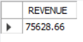
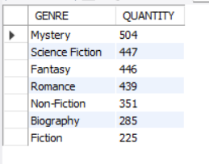
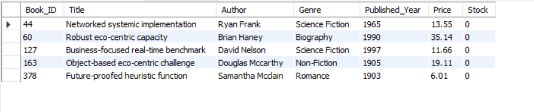

# Online Bookstore Analysis Using SQL

## Project Overview

This project focuses on analyzing a relational Online Bookstore database using SQL to extract meaningful business insights.
The objective was to evaluate revenue performance, customer ordering patterns, book popularity, and genre-wise sales distribution using structured queries based on real-world transaction data.
The analysis was performed using a series of complex SQL queries to bridge data between inventory, customers, and sales.

## Dataset Description

The database consists of three related tables:

- Books: Detailed catalog including Author, Genre, Price, and Stock.
- Customers: Database of registered users with City and Country details.
- Orders: Transactional records capturing Order Date, Quantity, and Total Amount

### Table Relationships

Customers → Orders → Books

The dataset contains order timestamps, customer demographics, and detailed book information.

## Tools & Technologies Used

- MySQL Workbench  
- SQL  
- Joins (INNER JOIN)  
- Aggregations (SUM, COUNT, AVG)  
- Subqueries  
- Window Functions (SUM()) 

## Business Problems Solved

- Retrieve all books within the "Fiction" genre.
- Find books published after the year 1950.
- List all customers residing in Canada.
- Filter orders placed during November 2023.
- Retrieve the total stock of books available in the inventory.
- Identify the most expensive book in the catalog.
- List customers who ordered more than 1 quantity of any book.
- Find the book with the lowest current stock level.
- Calculate the total revenue generated from all successful orders.
- Find the average price of books specifically in the "Fantasy" genre.
- Retrieve the total number of books sold per genre.
- List customers who have placed at least 2 separate orders.
- Find the most frequently ordered book based on transaction count.
- Identify the top 3 most expensive books within the 'Fantasy' genre.
- Calculate the real-time stock remaining for each book after fulfilling all orders.

## Sample Query Results

 
### Total Revenue Generated

### Genre-wise Sales Performance

### Customer Loyalty (2+ Orders)

### Lowest Stock

## Key Sales & Performance Metrics

- Total Orders Placed: 500
- Total Catalog Size: 500 unique titles.
- Highest Priced Book: "Proactive system-worthy orchestration" priced at $49.98.
- Top Ordering Country: Nicaragua and Denmark show high customer frequency.

## Product & Category Performance

### 🔹 Top Genre Performance (Quantity Sold)

- Fantasy: High demand with frequent multiple-quantity orders.
- Science Fiction: Consistent performance across varied price points.
- Biography: Driven by high-value individual purchases.
  
### 🔹 High-Value Authors

- Authors like Joseph Jensen and Christopher Andrews show strong sales footprints.

## Operational Insights

- Demand Spikes: Significant order volume identified in November 2023.
- Stock Criticality: Several titles have reached the "Minimum Stock" threshold, requiring immediate replenishment.
- Order Volume: Majority of transactions involve quantities greater than 1, indicating bulk purchase behavior.

This indicates strong mid-day and evening demand patterns.

## Revenue Insights

### 🔹 Top Revenue Contributors

- High-priced Fantasy titles contribute significantly to the total revenue despite lower quantity compared to Fiction.
- Orders exceeding $30 are primarily concentrated in specific cities like East Craigfort and Schroederton.

## Advanced Analysis

- Customer Lifetime Value: Identified top-spending customers by aggregating TOTAL_AMOUNT per CUSTOMER_ID.
- Inventory Management: Developed a dynamic query to subtract QUANTITY from STOCK to track real-time availability.
  
## Business Recommendations

- Inventory Optimization: Restock books identified with the lowest current stock to prevent loss of sales.
- Loyalty Marketing: Target customers with 2+ orders for premium membership or discount programs.
- Regional Focus: Expand shipping and marketing efforts in high-spending countries like Canada.
- Genre Promotions: Bundle lower-priced books in popular genres (Fantasy/Fiction) to increase average order value.

## Project Files

- analysis_queries.sql → Contains all SQL queries used for analysis.
- screenshots/ → Contains selected result outputs
